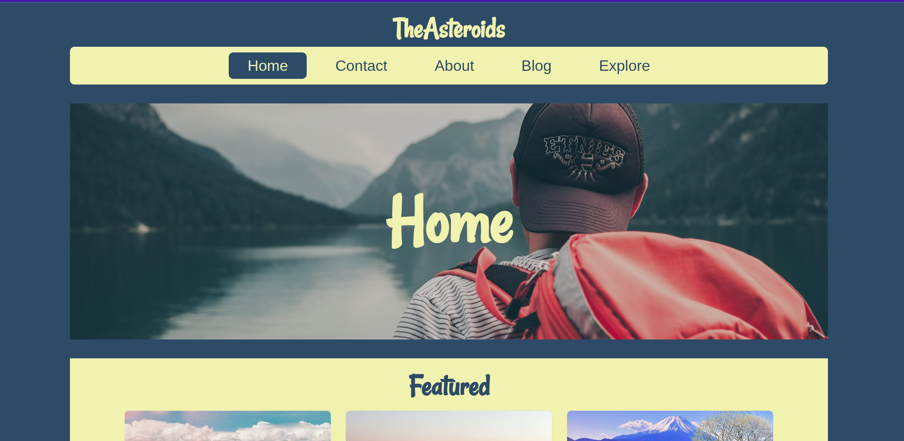

# TheAsteroids

A travel blog website. Developed for my Web Programming Course. 3rd Semester, Computer Science.

## Demo

You can checkout the demo [here](https://the-asteroids.vercel.app/).


## Run Locally

Clone the project

```bash
  git clone https://github.com/anmoljhamb/TheAsteroids
```

Go to the project directory

```bash
  cd TheAsteroids
```

The following files need to be added to make sure the website runs locally. Examples can be found in the same directory for the respecive files.

-   client/.env
-   server/config.env

Install dependencies for server

```bash
  cd server
  npm install
```

Start the server

```bash
  npm run dev
```

Install dependencies for client

```bash
  cd client # cd from the root directory.
  npm install
```

Start the client.

```bash
  npm start
```

## Tech Stack

**Client:** React, SCSS. More about client on [client/README.md](./client/README.md)

**Server:** Node, Express, MongoDB. More about Server on [server/README.md](./server/README.md)

## Feedback

If you have any feedback, please reach out to me at talktoanmol@outlook.com
